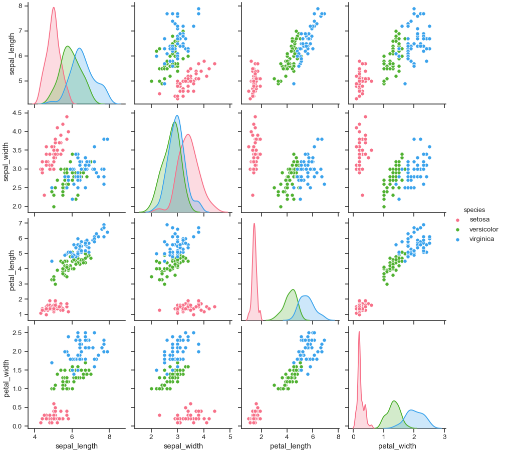

# Capstone Project

## Perfume Ratings

*Worked by Kalina Zeligowska Serej*

***

The aim of this project was to create a model statisctical making predictions on perfumes ratings.

I based on the data from fragrantica.com - a popular internet portal for fragrance's lovers. Exploring users preferences and interests alowed me to get a deep understanding of the perfumes rating system.

Utilising this kind of prediction, can help to create better communication between manufactures, sellers/dealers (?) and customers, especially those who exist on the online market. (?)

***

If you are interested with this project and would like to discuss details, please contact me directly on the following:
* [kalina.zeligowska@gmail.com]()

*** 

### Executive Summary

The dataset, what I worked on, includes the informations scraped off of the fragrantica.com website.

I took it from [https://www.kaggle.com/sagikeren88/fragrances-and-perfumes]() as a ready-to-use csv file.

My code is split into separated notebooks to keep is as clear and readable as possible.

1. Data cleaning and Preparation 
* the biggest issue - a correct understanding the data and the way it was collected
* doprowadzić do ujednoliconego typu
* poradzenie sobie z danymi które zakłócały arkusz - mała ilość głosów
* zdecydowanie które kolumny są istotne
* zmienna accords - very messy

*** 

Third, you then write what you did on the project that is a bit more technical.
Here you might say that you took data from [here and make it a link to the original data]() and then ran `a list of models you ran here` in your analysis.
Then end with one sentence that picks what your best model was and how it performed.

Lastly, you say in one or two sentences why this matters. 
For example, now as opposed to before this data analysis, you can now predict X better than Y. 

The goal of this project was to create a `regression/classification` model that was able to predict `what you set out to do`.

> If you are able to swap out the text here with what your case example is you will demonstrate the following:
> 1. You get why what you're doing 'matters'
> 2. You are able to take ill defined problems and turn them into something a data scienst can solve
> 3. You show off your analystical and modeling chops.
> 4. You are able to communicate technical things you do.

### More Information

Below your Executive Summary, you can document whatever you feel would be of interest to a future employer.
Here I would especially suggest diving a bit deeper into your methodology and including images that you are proud of from the project. 
Remember, that people will probably judge your github project page within 45 seconds tops, you want it to look as clean as possible. 

Write documentation that looks like someone you would want to work with.

### Show Off Your Data Viz

> Image taken from `seaborn` [documentation](https://seaborn.pydata.org/generated/seaborn.pairplot.html)

**DO NOT PUT THE GOOD BITS OF YOUR PROJECT BURRIED AWAY AT THE BOTTOM OF YOUR README, YOU ARE NOT WRITING A DETECTIVE NOVEL**

