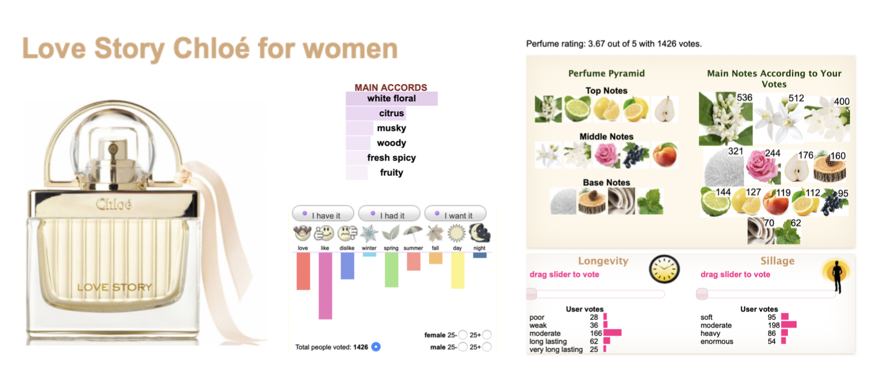
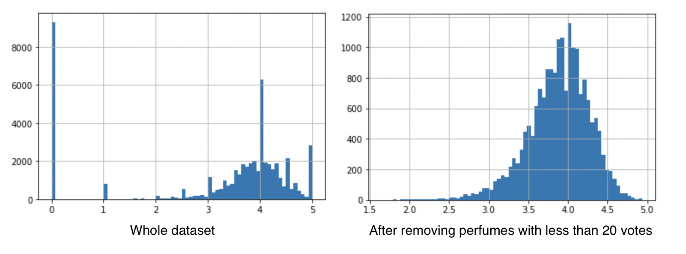

# Capstone Project

## Perfume Ratings

*Worked by Kalina Zeligowska Serej*

***

The aim of this project was to create a statisctical model making predictions on perfumes ratings.

I based on the data from fragrantica.com - a popular internet portal for fragrance's lovers. Exploring users preferences and interests alowed me to get a deep understanding of the perfumes rating system.

Utilising this kind of prediction, can help to create better communication between manufactures, sellers/dealers (?) and customers, especially those who exist on the online market. (?)

***

If you are interested with this project and would like to discuss its details, please contact me directly on the following:
* [kalina.zeligowska@gmail.com]()

*** 

## Table of Contents

1. <a href="https://github.com/kalina-kalina/perfumes_ratings/blob/master/README.md#1-file-descriptions" target="_blank">File descriptions</a>

2. <a href="https://github.com/kalina-kalina/perfumes_ratings/blob/master/README.md#2-technologies-used" target="_blank">Technologies Used</a>

3. <a href="https://github.com/kalina-kalina/perfumes_ratings/blob/master/README.md#3-executive-summary" target="_blank">Execiutive Summary</a>

4. <a href="https://github.com/kalina-kalina/perfumes_ratings/blob/master/README.md#4-more-information" target="_blank">More Informations</a>

* <a href="https://github.com/kalina-kalina/perfumes_ratings/blob/master/README.md#how-does-the-rating-system-work" target="_blank">How does the Rating System work</a>

* <a href="https://github.com/kalina-kalina/perfumes_ratings/blob/master/README.md#how-does-the-rating-system-work" target="_blank">Most important steps from Data Cleaning and Preparing</a>

* <a href="https://github.com/kalina-kalina/perfumes_ratings/blob/master/README.md#how-does-the-rating-system-work" target="_blank">Most important steps from Modelling</a>

5. <a href="https://github.com/kalina-kalina/perfumes_ratings/blob/master/README.md#5-limitations-andd-future-works" target="_blank">Limitations and Future Works</a>

***

### 1. File descriptions

***

### 2. Technologies Used

***

### 3. Executive Summary

The dataset, what I worked on, includes the informations scraped off of the fragrantica.com website.

Fragrantica.com is a portal for perfume lovers. Is has three main fillars - an catalogue, an independent magazine and a community - users who comment, disscuse and assess perfumes.
Each bottle of fragrance JAK JEST OCENIANA

I took the dataset from <a href="https://www.kaggle.com/sagikeren88/fragrances-and-perfumes" target="_blank">kaggle.com</a> as a ready-to-use csv file.

My code is split into separated notebooks to keep is as clear and readable as possible.

(tu są kolejne pliki i główne punkty)

1. <a href="https://github.com/kalina-kalina/perfumes_ratings/blob/master/01%20-%20Data%20cleaning%20and%20preparation.ipynb" target="_blank">Data cleaning and preparing</a>

* the biggest issue - a correct understanding the data and the way it was collected
* doprowadzić do ujednoliconego typu
* poradzenie sobie z danymi które zakłócały arkusz - mała ilość głosów
* zdecydowanie które kolumny są istotne
* zmienna accords - very messy

2. <a href="https://github.com/kalina-kalina/perfumes_ratings/blob/master/02%20-%20Modelling.ipynb" target="_blank">Modelling</a>

* ujednolicenie skal zmiennych
* checking a multicolinearity and deciding which of higly correlated variables remove
* spliting the data to prepare if for moddeling
* linear regrassion model

3. "TO BE CONTINUATED"

*** 

### 4. More Information

### How does the rating system work:

Each bottle of fragrance is described of several parameters (according columns of the dataset):
* basic information such as: title, brand, year of (wprowadzenia na rynek)
* accords - main elements/ingredients of a fragrance

> Accords for perfumes are the same as ingredients for meals, colours for paintings or notes/sounds for music. 
>
> Top 10 most common accords: 
>
> woody, citrus, floral, sweet, aromatic, fresh spicy, fruity, white floral, balsamic, powdery, green, warm spicy, musky, vanilla, rose.

* rating_score - mean value of users votes
* votes - the number of votes submitted by users
* perfume's longevity: poor, weak, moderate, long or very long
* perfume's sillage: soft, moderate, heavy or enormous
* user's preferences (also split into sex and age categories): love/like/dislike, for winter, spring, summer or autumn, cold or hot day, day or night, have/had/want- more details about accords
* target group: women, man or unisex 

> Images taken from [fragrantica.com](https://www.fragrantica.com/perfume/Chlo-/Love-Story-26227.htmll)

Voting for a perfume it's not required to mark each aspect. It brings an inbalance in ratings (an amount of grades for each column don't have to be correlated with a general amout of votes).

### Most important steps from Data Cleaning and Preparing:

1. Small amount of votes

Going through the data exploring, it emerged that distribiuton of 'rating_score' variable is disrupted by products with a
low amout of votes. The less votes, the more likely the value of 'rating_score' is the integer number. After removing perfumes with less than 20 votes, distribiution improved.

2. Messy 'accords' column. 

In each cell of this column was a set of accords labels, interrupted by labels such as 'Videos' and 'Pictures' (these two labels are the result of web scrapping). I decided to split all of them into separeted columns, remove worthless labels, create new columns for each of the accords and fill them with 0 (when a perfume doesn't have this accord) and 1 (when a perfume has this accord).

3. Longevity and Sillage

Because of an imbalance in ratings, these two features were difficult to understand. I counted weighted aritmetical mean for each of them to get them easier to compare.

4. Season

Here also, because of an imbalance in ratings, season's features were difficult to ccompare. I decided to present them as a ratio of an amount of votes for specific season to sum of votes for all seasons.

### Most important steps from Modelling:

1. Data scaling

Not every feature from the dataset had the same range of values. I scaled three of them: 'votes', 'longevity' and 'sillage' using MinMaxScaler from Scikit-learn library. 

2. Checking a multicolinearity

There was a multicolinearity between season's and gender's variables. It could mean that users voting for winter, voted for autumn as well. And voting for summer, voted for spring as well. After removing 'autumn' and 'spring', there are no issues with multicolinearity between this group of variables. I decided to leave variables easier to understand- now seasons is split between hot(summer) and cold(winter).
The same situation was with gender_man and gender_unisex. After removing gender_unisex, there is no no issues with multicolinearity.

***

### 5. Limitations andd Future Works

